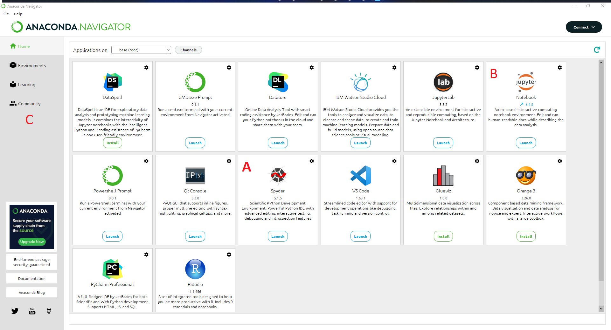
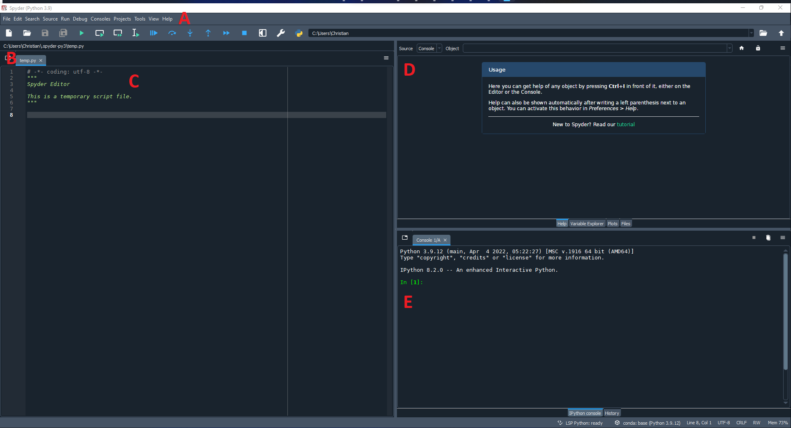
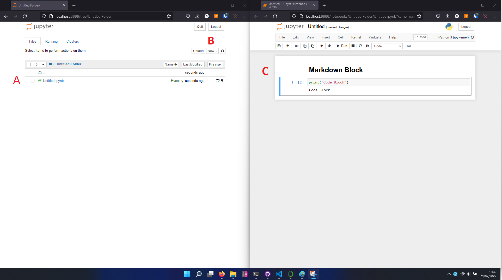

# Accessing python on University Machines

## Any Cluster machine

For use when on campus in a cluster or laboratory.

1) Login to your user account
2) Open up "AVD" desktop icon by double clicking
3) Select "Tier 1 Desktop" icon near the top of the screen
4) Login again with your usual password
5) After the new virtual desktop has loaded clock the start button and open up "anaconda 3" and then "Spyder"

## Using the virtual desktop from any browser (even your own machine)

This method differs only in that you connect to the university machines from any web browser, even on your own machine.

1) Firstly login to [AVD](https://client.wvd.microsoft.com/arm/webclient/index.html) from any web browser with your university credentials
2) After the new virtual desktop has loaded clock the start button and open up "anaconda 3" and then "Spyder"

# Accessing Python on your own Machine

If you want to work on your own computer, the best way to access python and all of it's add-on packages, then the best application to use is [Anaconda](https://www.anaconda.com/products/distribution)

## Anaconda 

[Anaconda](https://www.anaconda.com/products/distribution), also known as the shortened Conda, is a python based app where you can manage many different aspects of a python workspace, for example creating virtual environments for a projects and installing extra packages. All within a handy graphical user interface. It like python is open source and freely available for all operating systems. 

### Installation

To install anaconda: 

1) Open up the web page and download the installer relivant to your operating system: [Download Anaconda](https://www.anaconda.com/products/distribution) 
2) Launch the installer and run through the setup procedure, its best to just use the default options for now. Specific [Windows](https://docs.anaconda.com/anaconda/install/windows/) and [macos](https://docs.anaconda.com/anaconda/install/mac-os/) instructions.
3) Once installed you can open up anaconda from the desktop shortcut (if you chose to have one added), or by searching for anaconda in the taskbar. 

    >Note if you are using the university AVD system, then Anaconda will already be installed

# Anaconda basics

    A) Spyder app
    B) Jupyter notebook app
    C) Conda Menu

Once you have either installed or accessed the Anaconda launcher you can then launch an environment ready for running python code. The courses at Newcastle University that do use Python recommend using the Spyder IDE, but there are other ways to run Python code that you may choose to use.

# Spyder IDE

Spyder is an IDE (integrated development environment), we can use this environment to write python code, run the code and debug our mistakes.

    > Spyder should already be installed by default when you install Anaconda, but if it is not there should be a prompt to install spyder on the home page. If that isn't available see the "Installing a Package" section.

    A) Generic menu, use this to save and load files etc.
    B) Tabbed workspaces, you can open more than one file and switch between them here.
    C) Current opened python file.
    D) Help window, can also be switched to variable explorer and this is where plots will appear by default.
    E) The terminal window, this is where you will see error messages.

# Jupyter Notebook

Jupter notebook also is provided by default with anaconda, and is similar to Spyder. However where it differs is that code is written and executed in blocks. Allowing both the use of python code and markdown code, the latter is used for documenting and commenting on your code, useful for presentations! This provides an excellent way of prototyping code in a scientific way where we need to plot a lot of data.

    A) File browser tab, this is the window that opens up when you first start jupyter. You can browse, rename and move files from here.
    B) Make new python and jupyter notebooks from here.
    C) This is your jupyter notebook file open, here you can start to add coding blocks. 

# The Installation of python packages using anaconda

You may find that the python package that you want to use is not included in the Anaconda installation by default and therefore it must be installed manually. To install a package to the default environment take the following steps 

1) Open the Anaconda navigator and select the "Environments" tab 
2) Make sure "All" packages is selected in the dropdown menu
3) Search for the package you want in the search box (top right)
4) When you find the package you want, check the box next to its name to flag that package for installation then click "Apply" in the bottom right to install all the packages you've flagged. 
5) It will take some time but Anaconda will now install the packages you have selected.

You can see a list of the already installed packages if you change the dropdown menu to "installed". 

# Separate Python Environments  

Using anaconda you may want to generate new and separate work environments for each project depending on what you are doing. This is usually done when using obscure or sensitive python addons that only work with certain versions of other packages. This probably won't be necessary for the vast majority of people, however it is good practice when starting a new project to simply create a new python environment for development, especially if you are creating a user interface for an application. 

To do this follow these simple steps: 

1) Open up the Anaconda navigator and select the "Environments" tab.
2) Usually you will have an environment that you want to clone rather than creating a new enviroment, so select that environment and click the "clone" button to create a copy. Otherwise click the "Create +" button and give your new environment a name. 
3) Anaconda will now install a new environment and then "activate" that environment now. 
4) You can now start to use the new environment, or install packages  

